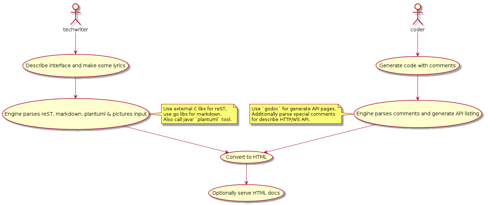

# Where's the fucking manual?

The tool for lazy programmers to maintain docs with code in `go`.
It oriented on documenting `go` code and useles for other langs.

## Status

Program yet unusable and development only started. If you interested in
this tool for `go` just vote project with a star.

## Why?

0. Of course I use `godoc` for generating documentation for `go` code. But
it lacks support for light text markups like `markdown` and not comfortable
for keeping documentation tree not naily binded to structure of your code.

1. I like sphinx way to build docs for it flexibility. It allow to combine
autogenerated APIs based on code comments with handwriten texts. So it
useful for teams with dedicated technical writer. But sphinx mostly
oriented on Python and can't generate API for go code.

2. I like swagger for generating live API for testing HTTP interfaces. But
swagger need support from webframework which you used. Not many of go
frameworks has such support. So to describe arbitrary HTTP API we need
to use special comments like for example doxygen does. I think it not
good way but it better than nothing.

3. I use both reST and markdown formats and want to mix them in docs.

4. I use plantuml for diagrams and illustrations as it well fits in vcs
with code and text docs.

5. I want a HTML output for both and simple tool to serve these pages
without setup external webserver.

So I started to experiment with this new tool named `wtfm`.

##Documentation samples

    // Sample method
    //
    // #http /example/method
    //
    // Query params:
    // :test int: just a number
    // :test2 string

Will generate reST code:

    Sample method
    ==============

    ``[GET] /example/method``

    Parameters in a query:

    .. glossary::
      ``test`` int
         just a number
      ``test2`` string
